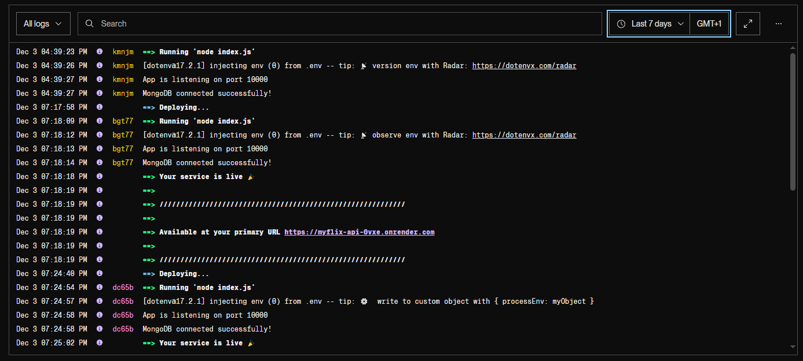
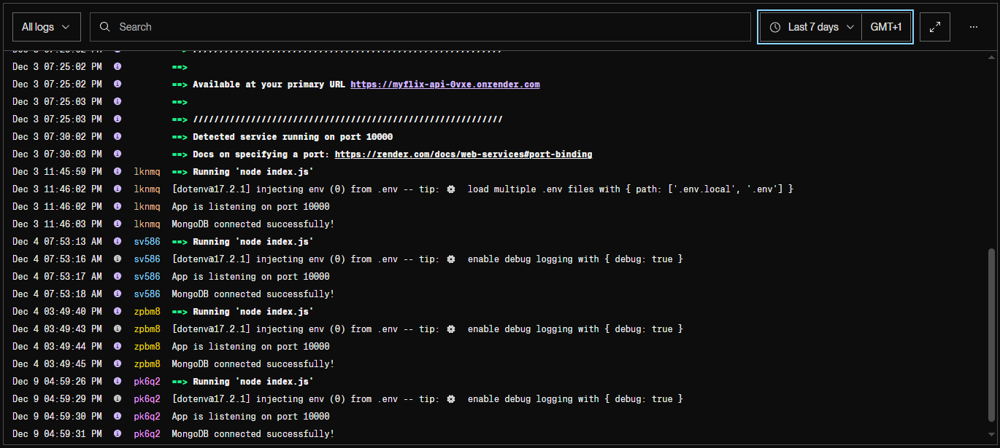

## Movie API – REST Backend for myFlix Application

A fully documented and production-ready REST API built with Node.js, Express, MongoDB, and JWT authentication.
This backend powers the myFlix web application (React client) by providing secure access to movies, users, genres, and directors.

---

## Project Context (Achievement 2 – CareerFoundry)

This project was developed as part of the CareerFoundry Full-Stack Web Development Program, focusing on building a complete backend architecture with:

- Secure user management
- Token-based authentication
- Movie database queries
- Data validation & error handling
- Integration-ready endpoints for any frontend (Angular/React)

Target users:

- Frontend developers integrating with the API
- Movie lovers testing API requests
- Recruiters evaluating backend skills

---

### 🚀 Main Features

# Movies

- Get all movies
- Get movie by title
- Get genres and directors

# Users

- Register, login, update profile, deregister
- Add/remove favorite movies
- Secure password hashing (bcrypt)

# Security

- JWT authentication
- Passport.js (Local + JWT strategies)
- Input validation (express-validator)
- CORS enabled

--- 

### Technologies Used

- Node.js + Express
- MongoDB + Mongoose
- JWT Authentication
- bcrypt
- CORS
- express-validator
- Postman (Testing)
- JSDoc + Minami (Documentation)

---

### 🌐 Live & Documentation Links

# Backend (Live)
https://myflix-api-0vxe.onrender.com

> [!Visiting this URL does not display a webpage — it's an API only.]

# Postman Collection (Public Link)
(Inserire link dopo averlo generato)
Example placeholder:
https://www.postman.com/collections/YOUR_COLLECTION_ID

# API Documentation (JSDoc – Minami Theme)
https://ghostmaruko.github.io/movie_api/documentation/

(Questo link funzionerà dopo che generiamo e pubblichiamo la nuova JSDoc)

# GitHub Repository (Backend)
https://github.com/ghostmaruko/movie_api

---

### API Endpoints

Base URL: https://myflix-api-0vxe.onrender.com
Most endpoints require a valid JWT token.

### Authentication

Method	  |    Endpoint	   |   Notes
POST	    |    /users	     |   Register (public)
POST	    |    /login	     |   Login & receive JWT (public)

---

### Movies

Method	    |
|
|
|
|
|    Endpoint	      |
|
|
|
|
|      Auth	                      Description
GET	            /movies	              ❌ (temporary)	            Get all movies
GET	            /movies/:title        ✅	                        Get movie by title
GET	            /genres/:name         ✅	                        Get genre info
GET	            /directors/:name	    ✅	                        Get director info

---

### Users

 Method	    |      Endpoint	                         |   Auth	        |    Description
POST	      |     /users/:username/movies/:movieID	 |    ✅	               Add favorite
DELETE	         /users/:username/movies/:movieID	      ✅	              Remove favorite
PUT	             /users/:username	                      ✅	              Update user
DELETE	         /users/:username	                      ✅	              Delete user

---

**Authentication:** 
All routes (except `POST /users` and `POST /login`) require JWT authentication.

**Authorization:** 
Passport.js with Local and JWT strategies.  

**Passwords:** 
Hashed using bcrypt. 

**Testing:** 
All endpoints tested with Postman.

---

## Frontend

⚠️ **Note:** This project no longer includes a frontend served via Express.  
The frontend has been moved to a separate project built with **React**:  
[myFlix-client (React Frontend)](https://github.com/ghostmaruko/myFlix_client)

All API endpoints (e.g., `/users`, `/movies`) are now **exclusively accessed by the frontend React app** or API clients (e.g., Postman, curl).

To test the backend manually, use Postman with a valid JWT token.

---

## Project Structure

- index.js – main entry point, server setup, route registration, middleware, and TypeDoc integration
- models/ – Mongoose models for Movies and Users
- routes/ – Express routes for API endpoints
- controllers/ – business logic for each route
- docs/ – TypeDoc generated documentation
- package.json – project dependencies and scripts

---

## Notes on Testing the Backend

⚠️ Important: All protected API endpoints require a JWT token. You cannot directly test them via a browser. Use Postman (or another HTTP client) with the token to access routes like /users, /movies/:title, etc.

---

## Testing Instruction (Postman):

1. Register a user via POST /users.
2. Login via POST /login to receive a JWT token.
3. In Postman, set Authorization → Bearer Token with the received JWT.
4. TUse the token to test protected routes like:
   -  /movies/:title
   -  /users/:username
   -  /users/:username/movies/:movieID

All requests have been fully tested with Postman.

---

## Deployment

✅ MongoDB Atlas connected via Mongoose  
✅ Environment variables used (`CONNECTION_URI`, `PORT`)  
✅ App deployed to Heroku  
✅ CORS enabled for all origins  
✅ All endpoints fully tested and verified

---

### Development Notes

- Password hashing applied on registration and login
- Data validation added using `express-validator`
- All API features from Achievement 2 and 3 implemented
- Images served statically with path normalization
- Postman collection and screenshots included for API testing
- Documentation updated with full endpoint details and example requests/responses

---

### Deployment

The API is deployed on **Render** and publicly accessible at:

- [https://myflix-api-0vxe.onrender.com](https://myflix-api-0vxe.onrender.com)

For local development, follow the installation steps above.

# Screenshot

**Logs**

---

### Author

Marco Esu – 2025
